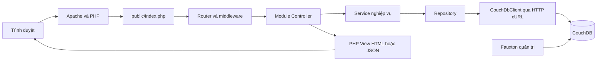

# Kế hoạch chuyển đổi WEBTHOITRANG sang PHP và CouchDB

Ngày lập: 06/10/2026. Nguồn khảo sát: mã nguồn trong `WEBTHOITRANG`, các script SQL, `bulk_docs.json` và `Tai_lieu_cong_nghe_du_an_CouchDB_PHP.docx`.

Đề xuất xây dựng ứng dụng PHP mới theo module, giữ nghiệp vụ và giao diện hữu ích của website hiện tại, đồng thời thiết kế lại lớp dữ liệu theo document aggregate. Backend C# và Entity Framework cần được viết lại; đây là chuyển đổi công nghệ và mô hình dữ liệu, không phải thay connection string. Phạm vi cuối cùng bao gồm chức năng đang có; bản chạy được sau bốn tuần là mốc trung gian, còn đánh giá và đối soát đầy đủ nằm ở các mốc tiếp theo. Đến 06/10/2026, mapping/schema/fixture v2 đã chuẩn bị, Docker stack chạy và 347 fixture documents đã được đối chiếu. PHP hiện đã có catalog, tài khoản/giỏ hàng, checkout, lịch sử đơn, quản lý trạng thái đơn, review và CRUD sản phẩm cơ bản; các giới hạn còn lại ghi tại phần tiến độ.

## 1. Hiện trạng đã kiểm tra

| Thành phần | Kết quả khảo sát | Hệ quả đối với chuyển đổi |
| --- | --- | --- |
| Runtime và thư viện | .NET Framework 4.8; MVC 5.2.9; Entity Framework 6.5.1; Bootstrap 5.2.3; jQuery 3.7.0 | Giữ HTML/CSS/ảnh phù hợp, viết lại C# và Razor, chuyển phần JavaScript phụ thuộc jQuery sang Vanilla JS theo tài liệu đích |
| Model EF | EDMX và `ShopQuanAoEntities`, mô hình sinh từ database | Không chuyển từng EF entity thành một document độc lập |
| Backend khách hàng | `HomeController.cs` chứa catalog, đánh giá, tài khoản, giỏ hàng, tính tiền, checkout và đơn hàng | Tách thành nhiều module và service nhỏ |
| Backend quản trị | `DashboardController.cs` chứa tạo/xóa mềm sản phẩm, cập nhật đơn và doanh thu | Tách Catalog, Orders, Shipping, Reporting; dùng kiểm tra quyền chung |
| SQL | 13 bảng nghiệp vụ, 3 trigger; có cột tiền tính toán | Chuyển tổng tiền, tổng số lượng và phí ship sang service; thiết kế lại ràng buộc |
| Foundation PHP tại workspace | `PHP_COUCHDB`: PHP 8.3/Apache, Composer PSR-4, Router, CouchDbClient và Docker Compose | Chạy trên localhost; tiếp tục hoàn thiện module và nghiệm thu nghiệp vụ theo phần tiến độ |
| Seed CouchDB | 53 document: 3 customer, 2 staff, 24 product, 3 cart, 13 order, 5 voucher, 2 shipping_method, 1 design document | Là bộ demo ban đầu; chưa chứng minh chuyển toàn bộ SQL |
| Fixture chuyển đổi v2 | Đã import/đối chiếu trong `retail_order_delivery_test`: 48 product, 270 review, 3 cart, 3 customer, 2 staff, 13 order, 5 voucher, 2 shipping_method, 1 validator | Đã xác nhận trong Docker local; chưa provision hash demo, chưa thay cho export từ SQL Server thực tế |
| Catalog SQL mẫu | 48 sản phẩm, seed CouchDB chỉ chứa 24 | Bổ sung 24 sản phẩm còn thiếu và các variant/ảnh tương ứng cho chuyển đổi đầy đủ; G06, G09 đang được giao diện cũ dùng trong mục thịnh hành nhưng chưa có trong seed |
| Metadata seed | 52 document nghiệp vụ dùng `_meta` | Chuẩn hóa thành `meta` trước import, đúng yêu cầu trong Word |
| Tài khoản seed | 5 tài khoản có `password_hash: null`, `requires_password_reset: true` | Cần luồng cấp/reset mật khẩu trước demo đăng nhập; không xem tài khoản seed là dùng được ngay |
| Đánh giá | SQL và ứng dụng có `DANH_GIA`; seed và validator chưa hỗ trợ review | Bổ sung contract và migration cho review để giữ chức năng hiện có |

Khảo sát trên là kiểm tra file tĩnh. Chưa build ứng dụng ASP.NET, chưa kết nối SQL Server hoặc xác minh container CouchDB đang chạy. CSDL thực tế có thể khác script dữ liệu mẫu; cần export từ nguồn đang dùng nếu mục tiêu là dữ liệu thực tế.

## 2. Kiến trúc đích

Tuân theo mục 2–11 của tài liệu: PHP 8.3, Apache, Composer PSR-4, phpdotenv, CouchDB 3.x, Fauxton, Bootstrap 5, Vanilla JavaScript, Docker Compose. Chọn ứng dụng nguyên khối theo module; các module cùng chạy trong một app PHP.



Controller nhận input và chọn response; Service quyết định nghiệp vụ; Repository đóng gói truy vấn; CouchDbClient xử lý HTTP, authentication, timeout, encode/decode JSON và lỗi. View chỉ hiển thị. Mọi kết nối database đi qua client chung. Fauxton phục vụ quản trị và minh chứng, không xử lý nghiệp vụ bán hàng.

```text
D:\PHP_NOSQL\
  WEBTHOITRANG\                 ứng dụng cũ để đối chiếu
  PHP_COUCHDB\                  ứng dụng mới dự kiến
    public\
      index.php
      .htaccess
      assets\{css,js,img}\
    src\
      Core\                    Router, Request, Response, Session, CSRF, View
      Infrastructure\CouchDB\  CouchDbClient và các exception
      Modules\
        Auth\
        Catalog\
        Cart\
        Checkout\
        Orders\
        Shipping\
        Vouchers\
        Reporting\
        Reviews\
    templates\{shared,customer,admin}\
    config\                    routes, app, database
    database\couchdb\          seeds, schemas, indexes, queries, design-docs
    scripts\                   import, verify, migrate, recover-checkout
    tests\{unit,integration,functional}\
    docs\                      mapping, rules, API, migration, evidence
    Dockerfile
    docker-compose.yml
    composer.json
    composer.lock
    .env.example
```

Chỉ `public/` được Apache phục vụ. Các tên thư mục trên là đề xuất, chưa phải cấu trúc đã tồn tại.

## 3. Phần giữ lại và phần chuyển đổi

| Hiện tại | Đích | Cách thực hiện |
| --- | --- | --- |
| `HomeController.Index`, `product_details` | CatalogController, CatalogService, ProductRepository | Viết lại truy vấn LINQ bằng truy vấn document; giữ bộ lọc, size, sản phẩm liên quan và mục thịnh hành |
| `register`, `login`, `Logout` | Auth module | PHP session, password hashing, quyền customer/staff/manager, bảo vệ đăng nhập |
| Các action thêm/sửa/xóa giỏ | Cart module | Giỏ khách trong session; giỏ thành viên trong một cart document; chốt quy tắc đồng bộ khi đăng nhập/đăng xuất |
| `GetOrderSummary`, `checkout`, `PlaceOrder` | CheckoutService, PricingService, InventoryService | Một nguồn tính giá cho preview và đặt hàng; đọc lại giá, trạng thái và tồn kho trước checkout |
| `order`, `ConfirmReceived` | Orders module | Kiểm tra chủ sở hữu đơn, chuyển trạng thái đúng luật, lưu lịch sử |
| Admin tạo/xóa mềm sản phẩm | Catalog admin | Lưu một product aggregate, cập nhật bằng `_rev`, quản lý ảnh upload |
| Admin danh sách/cập nhật đơn | Orders và Shipping admin | Kiểm tra quyền trên mọi endpoint, cập nhật trạng thái và thông tin giao hàng |
| `Revenue`, `GetRevenueStats` | Reporting module | Dùng cùng định nghĩa doanh thu cho màn hình và JSON API |
| `AddReview`, điểm sao, sắp xếp rating | Reviews module | Bổ sung review document, validator, index và migration |
| `.cshtml`, `@model`, `ViewBag`, `Html.*`, `Url.Action` | PHP templates và view data | Giữ markup phù hợp, viết lại binding, vòng lặp, link và form helper |
| jQuery AJAX và plugin | Vanilla JS và `fetch` | Kiểm kê plugin trước khi thay; giữ response contract cần thiết để giảm lỗi giao diện |
| CSS, Bootstrap, hình ảnh | `public/assets` | Kiểm tra đường dẫn thực tế, tài nguyên thiếu và giấy phép tài nguyên nếu có |
| SQL trigger, FK, CHECK, UNIQUE, computed column | Service, schema contract, design validation, quy ước ID | Không mặc định CouchDB tự bảo đảm các ràng buộc liên document |

Không chuyển nguyên file controller 1.000 dòng sang một controller PHP. Viết và nghiệm thu từng luồng từ giao diện đến database.

## 4. Thiết kế document và schema

| Nguồn SQL | Document đích | Quy tắc |
| --- | --- | --- |
| KHACH_HANG | `customer:<legacy_id>` | Hồ sơ, active, auth; giữ `legacy_id` để đối soát |
| NHAN_VIEN | `staff:<legacy_id>` | Hồ sơ và role; mật khẩu người dùng tách credential CouchDB |
| SAN_PHAM, DANH_MUC, CHI_TIET_SP, KICH_THUOC, HINH_ANH_SP | `product:<legacy_id>` | Nhúng `category`, `variants[]`, `images[]`; giữ variant ID cũ |
| GIO_HANG | `cart:<customer_id>` | Một giỏ/khách, `items[]`; document giỏ là nguồn dữ liệu bền của thành viên |
| DON_HANG, CHI_TIET_DON_HANG | `order:<legacy_id>` | Nhúng items, customer snapshot, receiver, shipping, discount, payment, totals, status_history |
| MA_GIAM_GIA | `voucher:<code>` | Loại giảm, giá trị, active và hạn mức; định nghĩa rõ thời điểm sử dụng/hoàn hạn mức |
| PHUONG_THUC_VAN_CHUYEN | `shipping_method:<code>` | Giá hiện tại trong danh mục; order giữ snapshot phí lúc mua |
| DANH_GIA | `review:<legacy_id>` | Document riêng tham chiếu product/customer; tránh mảng đánh giá tăng vô hạn trong product |

ID tham chiếu cần thống nhất. Seed hiện dùng `product_id: A01` nhưng `_id: product:A01`; Repository phải có hàm ánh xạ tập trung. Không ghép prefix rải rác. Đơn mới dùng ID chống trùng; không áp dụng cách đọc mã lớn nhất rồi cộng một khi có nhiều request.

Chốt contract trước triển khai:

- Giữ fixture v1 sau khi sửa `meta` để đối chiếu bộ demo 53 document. Khi thêm review, thông tin phục hồi checkout hoặc trường phục vụ truy vấn, tạo schema v2 có script nâng cấp và validator tương ứng. Không thêm field tự phát.
- Chuẩn hóa VND dạng số nguyên đồng nếu dữ liệu nguồn không có phần lẻ; nếu có, thống nhất biểu diễn thập phân chính xác trước export. Chốt quy tắc làm tròn giảm giá phần trăm.
- Timestamp dùng ISO 8601 với múi giờ rõ ràng; dữ liệu nguồn giả định `+07:00` phải được ghi nhận. Không bịa thời gian lịch sử chuyển trạng thái.
- Snapshot đơn mới lấy từ dữ liệu đã xác minh tại checkout. Giá lịch sử lấy `CHI_TIET_DON_HANG.DonGia`; tên sản phẩm hoặc phí giảm giá lịch sử không còn nguồn chính xác phải đánh dấu là tái dựng. Không ghi đè tiền lịch sử bằng giá catalog hiện tại.
- Mapping trạng thái: Chờ xác nhận → pending; Đang giao → shipping; Hoàn tất → delivered; Hủy → cancelled. `confirmed`, `packing` là bước mới theo schema đích, cần định nghĩa chuyển tiếp trước dùng.
- Category và size nhúng đáp ứng việc đọc sản phẩm; danh sách dùng cho form tạo sản phẩm phải có cấu hình/reference data quản lý được, không suy ra duy nhất từ sản phẩm đang active.
- `active: false` là xóa mềm nghiệp vụ. `_deleted` là thao tác xóa document của CouchDB; không dùng thay cho lưu trạng thái đơn/sản phẩm.
- Schema v2 cần mô tả field bắt buộc, enum, số lượng dương, stock không âm, price hợp lệ, variant ID duy nhất trong một product và công thức totals. `validate_doc_update` kiểm tra từng document; các quan hệ liên document vẫn do ứng dụng và bước verify xử lý.
- Đăng ký tài khoản cần cơ chế bảo đảm duy nhất theo định danh đăng nhập đã chuẩn hóa, ví dụ document giữ chỗ có `_id` xác định. Truy vấn Mango “chưa tồn tại” rồi insert không đủ chống đăng ký đồng thời; mọi document bổ sung phải được đưa vào contract.

## 5. Checkout và tính nhất quán dữ liệu

Đây là phần ưu tiên thiết kế sớm. Checkout hiện cập nhật order, chi tiết, stock và giỏ hàng; trong CouchDB chúng nằm ở nhiều document. `_rev` kiểm soát xung đột của từng document; `_bulk_docs` không phải giao dịch nguyên tử cho toàn bộ danh sách. Xem [CouchDB bulk transaction semantics](https://docs.couchdb.org/en/stable/api/database/bulk-api.html#bulk-documents-transaction-semantics).

Quy trình đề xuất cho bản chuyển đổi:

1. Client gửi checkout token; server gắn token với khách/session và fingerprint payload. Tạo order ID xác định từ thao tác để gửi lại request không tạo đơn mới. Cùng token nhưng payload khác phải bị từ chối.
2. Server đọc lại giỏ, product variants, voucher và shipping method; tính giá trên server. Không dùng tiền client gửi hoặc giá session cũ để quyết định số tiền cuối cùng.
3. Lưu order với snapshot và trạng thái xử lý kỹ thuật trong `meta.checkout`, theo schema đã chốt. Trạng thái kỹ thuật tách khỏi trạng thái giao hàng.
4. Giữ/trừ stock trên từng product bằng `_rev`; ghi dấu thao tác và thay đổi số lượng trong cùng lần ghi document để có thể kiểm tra một thao tác đã được áp dụng hay chưa. Nếu 409, đọc lại, kiểm tra stock rồi retry có giới hạn. Áp dụng nguyên tắc tương tự cho hạn mức voucher.
5. Khi tất cả bước thành công, đánh dấu checkout hoàn tất, công bố đơn cho luồng xử lý và xóa đúng các dòng đã mua khỏi giỏ. Giỏ khách nằm trong session; giỏ thành viên cập nhật bằng `_rev`. Lỗi xóa giỏ sau khi đặt hàng không được dẫn tới đặt lại đơn mới.
6. Nếu một bước thất bại, ghi trạng thái cần phục hồi và thực hiện bù trừ các bước đã áp dụng. Không trả stock bằng cách khôi phục nguyên bản document cũ vì có thể đè cập nhật của đơn khác.
7. Có script `recover-checkout` đọc trạng thái bền và dấu thao tác để tiếp tục hoặc bù trừ sau crash. Chạy lại script không trừ/hoàn stock hoặc voucher lần thứ hai. Nếu sau này có nhiều tiến trình phục hồi, phải có cơ chế nhận việc bằng revision để tránh xử lý đồng thời.

Thiết kế chi tiết marker, reservation và quy tắc dọn dữ liệu cần được hoàn thành ở tuần 1. Không xem checkout đạt yêu cầu chỉ vì chạy thành công với một người dùng. Bản local demo có thể dùng script phục hồi thủ công; vận hành thực tế cần lịch chạy và theo dõi lỗi phục hồi.

## 6. Quy tắc nghiệp vụ cần thống nhất

- Công thức tổng tiền: `subtotal = sum(quantity × unit_price)`; `grand_total = max(0, subtotal + shipping_fee - discount_amount)`. Chốt discount có bị giới hạn bởi giá trị hàng/phí ship hay không và áp dụng cùng quy tắc cho preview/checkout.
- Mã percent/cash/shipping, kiểm tra active, hạn mức và thời điểm hết hạn nếu bổ sung field. Code cũ kiểm tra số lượng ở phần preview nhưng checkout chưa thể hiện việc giảm hạn mức voucher; bản mới cần quy tắc nhất quán.
- Khách chỉ nhận/xem đơn của mình; đơn guest cần token truy cập phù hợp, không chỉ biết mã đơn. Mỗi endpoint admin phải kiểm tra role, kể cả endpoint POST/JSON.
- State machine dự kiến: pending → confirmed → packing → shipping → delivered; cancel chỉ ở những trạng thái cho phép. Chốt xử lý hủy, hoàn stock, hoàn voucher và quyền của customer/staff/manager.
- Thanh toán và giao hàng là hai trạng thái khác nhau. Đơn giao thành công không mặc định đồng nghĩa paid cho mọi phương thức; nếu COD đánh dấu paid khi nhận, viết quy tắc cụ thể. Ghi cả thời gian/người thực hiện chuyển trạng thái.
- Doanh thu hiện không thống nhất: `GetRevenueStats` cộng `TongTien`, còn trang `Revenue` cộng tiền sau ship/giảm giá. Đề xuất giữ cách của trang Revenue để so sánh: tổng `grand_total` của đơn delivered; đặt tên metric rõ và dùng cùng công thức ở API/UI. Các metric khác phải tách riêng.
- Giỏ thành viên không nên có hai bản bền độc lập trong session và CouchDB. Chốt merge giỏ guest khi login, xử lý variant trùng, giới hạn stock và giữ các dòng không được chọn mua.

## 7. Truy vấn và index

Thiết kế từ access pattern đang có, rồi kiểm chứng bằng `_find`, `_explain` và dữ liệu thật:

| Luồng đọc | Index khởi điểm cần thử | Ghi chú |
| --- | --- | --- |
| Catalog theo danh mục/active | type, category.code, active | Sort cần index và selector tương thích |
| Đơn của khách theo thời gian | type, customer.customer_id, ordered_at | Luôn lọc owner ở backend |
| Admin đơn theo trạng thái/thời gian | type, status, ordered_at | Thử cả case có/không status filter |
| Danh sách đánh giá | type, product_id | Thêm sort field nếu UI cần thứ tự |
| Doanh thu | type, status, ordered_at | Dataset nhỏ có thể aggregate ở service trên dữ liệu lọc; dataset lớn cân nhắc MapReduce view |

Catalog hiện lọc khoảng giá theo “có variant nằm trong khoảng”, nhưng sort theo giá nhỏ nhất. Không thay cả hai bằng cùng một `min_price` vì sẽ đổi hành vi bộ lọc. Nếu bổ sung `min_price` cho sort, cập nhật cùng product và contract; query lọc variant phải bảo toàn ý nghĩa hiện có.

Phân trang Mango dùng bookmark; selector/sort thay đổi thì reset bookmark. Customer/admin order list hiện dùng nút chuyển tới đơn cũ hơn và reset cursor khi đổi filter; catalog vẫn phân trang trong PHP, cần bookmark pagination trước khi dùng với dữ liệu lớn. Xem [Mango pagination và index](https://docs.couchdb.org/en/stable/api/database/find.html).

Tìm tên sản phẩm phải chốt quy tắc có dấu/không dấu và hoa/thường. Không mặc định `$regex` được JSON index tối ưu. Với 48 sản phẩm, có thể dùng phương án đơn giản đo được; nhu cầu dữ liệu lớn cần thiết kế tìm kiếm riêng. Không tải toàn database bao gồm customer/staff về để lọc phía trình duyệt.

## 8. Kế hoạch di chuyển dữ liệu

1. Chốt nguồn: script SQL mẫu hay SQL Server thực tế. Backup nguồn trước di chuyển; ghi số record từng bảng và các trường hợp NULL/dữ liệu sai.
2. Export snapshot nhất quán của các bảng liên quan; với hệ thống còn nhận đơn, phải có thời điểm khóa ghi hoặc phương án đồng bộ thay đổi. Bản đồ án có thể chốt ngừng ghi trong lúc export cuối.
3. Viết transformer từ SQL export sang document, giữ `legacy_id`. Không dùng regex SQL làm công cụ migration thực tế; regex khảo sát chỉ dùng kiểm kê file mẫu.
4. Tách seed demo khỏi dữ liệu đầy đủ. Sửa `meta`, bổ sung catalog còn thiếu, review và quy tắc tài khoản. Kiểm tra file ảnh thực sự tồn tại cho mỗi đường dẫn seed.
5. Validate JSON và schema trước import. Import vào database thử nghiệm riêng; kiểm tra lỗi từng phần tử `_bulk_docs`, không chỉ kiểm tra HTTP 201.
6. Importer hỗ trợ `--dry-run`/`--verify-only`, chạy lại có kiểm soát, từ chối ghi đè dữ liệu khác ngoài chế độ migration rõ ràng. Import design validation trước dữ liệu cần validate; index/design document được kiểm kê riêng.
7. Đối soát theo aggregate: số product, số variant, số ảnh, tổng stock theo variant, cart quantity, order item quantity/đơn giá/tổng tiền và orphan references. Review/customer/staff/voucher/shipping đối soát riêng.
8. Dữ liệu order trong seed có cờ `totals_recalculated`; xác minh lại với dữ liệu nguồn và công thức đã chốt, không mặc định seed là chuẩn kế toán.
9. Tài khoản thực tế cần reset có xác minh danh tính hoặc phương án chuyển hash phù hợp sau khảo sát. Tài khoản demo được cấp mật khẩu qua cấu hình/script local, lưu hash bằng PHP; không đưa plaintext hay credential thật vào Git. Xem [PHP password_hash](https://www.php.net/manual/en/function.password-hash.php).
10. Lưu báo cáo migration và sai lệch; chỉ chuyển sử dụng app mới khi các sai lệch đã giải thích hoặc sửa xong.

Mốc 53 document chỉ dùng cho fixture v1: 52 nghiệp vụ và 1 validator. Sau bổ sung catalog/review/schema/index, không dùng 53 làm tổng mong đợi của database đầy đủ.

## 9. Lộ trình thực hiện và nghiệm thu

Ước lượng tham khảo cho nhóm khoảng 3 người đã quen PHP/Docker, làm đều theo phạm vi đồ án: 4 tuần cho luồng chính, thêm 1–2 tuần để hoàn thiện tương đương chức năng cũ và đối soát. Đây là ước lượng công việc, chưa phải cam kết thời hạn; học công nghệ, dữ liệu thực tế và yêu cầu vận hành có thể làm tăng thời gian.

| Mốc | Công việc và đầu ra | Điều kiện hoàn thành |
| --- | --- | --- |
| Tuần 1 | Bảng chức năng và rule; mapping SQL/document; schema v1/v2; thiết kế checkout recovery; Docker app/CouchDB; PSR-4; Router; session/CSRF; client HTTP; importer; smoke test/index cơ bản | Fresh clone chạy được; app gọi `couchdb:5984`; seed v1 hợp lệ; GET/_find/409 được kiểm tra thật; schema bổ sung được thống nhất; không còn `_meta` trong dữ liệu import |
| Tuần 2 | Auth và phân quyền; reset/cấp mật khẩu demo; catalog đầy đủ; giỏ guest/member; layout PHP; chuyển AJAX quan trọng; truy vấn/filter/index | Login/logout đúng quyền; đủ catalog đã chốt; ảnh hiện đúng; thêm/sửa/xóa/đổi size và chọn dòng giỏ chạy đúng; không truy cập đơn/admin trái quyền |
| Tuần 3 | Pricing/voucher/shipping; checkout idempotent; reservation/bù trừ; đơn khách; script phục hồi; nâng contract và migration v2 | Đặt đơn tạo snapshot đúng; không âm stock; hai request cuối kho được xử lý đúng; gửi lại request không tạo đơn hoặc trừ kho lần hai; crash giữa các bước có thể phục hồi |
| Tuần 4 | Admin sản phẩm/upload ảnh/xóa mềm; đơn và giao hàng; trạng thái/payment; doanh thu thống nhất; tích hợp regression | Luồng khách → admin → delivered chạy hết; chuyển trạng thái sai bị chặn; ảnh upload tồn tại sau restart; doanh thu UI/API bằng nhau; demo có evidence Fauxton/index/query/conflict |
| Tuần 5–6 | Review/rating/filter còn lại; dữ liệu đầy đủ; kiểm thử thiếu sót; hướng dẫn chạy/backup/restore; migration cuối và chuyển sử dụng | Các chức năng cũ được đánh dấu đạt hoặc có quyết định thay đổi rõ ràng; đối soát đầy đủ; backup restore đã thử; vận hành app mới không phụ thuộc SQL Server |

Phụ thuộc chính: schema/foundation → auth/catalog/cart → checkout → trạng thái/admin/reporting → nghiệm thu đầy đủ. Reviews có thể làm song song sau khi contract được chốt. Không đợi tuần cuối mới kiểm thử xung đột và phục hồi.

Nếu nhóm 3 người, có thể chia trách nhiệm: (1) core/database/migration/integration, (2) customer/auth/catalog/cart/reviews, (3) admin/orders/shipping/reporting. Checkout do người phụ trách core và customer phối hợp, dùng cùng contract với admin. Mỗi mốc có một người chịu trách nhiệm tích hợp; không để nhiều người sửa schema/router tùy ý. Áp dụng feature → develop → main như tài liệu.

### Tiến độ thực hiện trong workspace

- Hoàn tất foundation Docker/PHP/CouchDB, importer an toàn và kiểm chứng 347 fixture documents trong database `_test`.
- Hoàn tất bước catalog đầu tiên: PHP Router/View, Mango indexes, trang danh sách với tìm kiếm/danh mục/khoảng giá/sắp xếp/phân trang; chi tiết sản phẩm với ảnh, biến thể, đánh giá đã có và sản phẩm liên quan. Bộ lọc giá giữ đúng quy tắc cũ: sản phẩm khớp khi có ít nhất một biến thể nằm trong khoảng.
- Đã chuyển trang giới thiệu `/about` từ MVC, gồm câu chuyện/phong cách và thông tin liên hệ; đã chuyển ba ảnh nội dung. Nội dung thanh toán/đổi trả chưa khả thi trong app mới không được trình bày như tính năng đã hỗ trợ.
- Đã kiểm tra: PHP lint toàn bộ source/template/script; Composer validate; `composer catalog:indexes` chạy lặp được; `composer seed:verify` vẫn xác nhận 347 fixture documents; smoke test HTTP cho danh sách, bộ lọc, chi tiết, ảnh tĩnh, health và 404 đều đạt.
- Hoàn tất giỏ khách vãng lai trong PHP session: thêm sản phẩm từ chi tiết, chọn dòng, tính tạm tính, cập nhật số lượng, đổi size/gộp biến thể trùng và xóa. Kiểm tra tồn kho ở server, CSRF cho mọi thao tác ghi và named volume giữ session khi tạo lại app container.
- Đã triển khai đăng ký khách hàng với password hash, đăng nhập/đăng xuất session có CSRF, role được lưu trong session, index username và cart document thành viên với merge giỏ guest theo tồn kho. Tài khoản mẫu chưa cấp hash vẫn bị từ chối rõ ràng.
- Đã kiểm tra luồng cart HTTP và trang login/register; integration smoke test tạo/xóa database riêng đã xác nhận đăng ký, xác thực và merge guest cart. `seed:verify` vẫn xác nhận 347 fixture documents, không có dữ liệu thử đăng ký trong database chính.
- Đã dựng checkout COD với snapshot order, kiểm tra lại sản phẩm/giá/tồn kho, phí ship và voucher; journal idempotent, stock/voucher reservation theo `_rev`, compensation và xóa đúng số lượng đã mua khỏi cart. Có lệnh phục hồi order thành viên; guest checkout dở cần retry trên session gốc.
- Integration smoke trên CouchDB database tạm đã kiểm tra đặt đơn, giảm stock/voucher đúng một lần khi replay cùng token, từ chối thiếu hàng, phục hồi journal ở `finalizing` và `compensating`, cùng hai tiến trình tranh đơn vị tồn kho cuối (chỉ một đơn thành công). HTTP smoke qua PHP server tạm xác nhận POST checkout thành công, flash và snapshot COD chính xác.
- Đã thêm lịch sử đơn chỉ đọc tại `/account/orders` và chi tiết `/account/orders/{id}` cho customer đang đăng nhập; query dùng ID trong session và trang chi tiết từ chối đơn của người khác bằng 404. Đã bổ sung Mango index `customer_orders`.
- Đã thêm màn hình admin `/admin/orders` lọc theo trạng thái và chi tiết đơn cho staff/manager. Server giới hạn chuyển trạng thái theo graph `pending → confirmed → packing → shipping → delivered`; chỉ hủy trước khi giao. Hủy đơn chưa thanh toán có journal khôi phục, restock và hoàn voucher bằng marker idempotent; đơn paid bị chặn do chưa có refund workflow.
- Đã khôi phục nghiệp vụ MVC khách xác nhận đã nhận đơn đang giao: POST có CSRF, xác minh đơn thuộc customer hiện tại, đổi trạng thái sang `delivered`, ghi audit history và xác nhận COD đã thu; retry idempotent. HTTP smoke xác nhận CSRF sai và đơn của khách khác không làm thay đổi dữ liệu.
- Integration smoke đã xác nhận: hủy hoàn stock/voucher đúng một lần, retry hủy không cộng lặp, resume cancellation journal sau crash mô phỏng, các transition terminal bị chặn, staff xem được danh sách/chi tiết còn customer bị 403.
- Đã thêm `scripts/provision_staff_password.php`: chỉ chạy với database `_test`, chỉ cập nhật đúng staff hiện hữu, yêu cầu TTY, nhập/nhập lại khi terminal tắt echo và chỉ lưu password hash.
- HTTP smoke trên database tạm chạy qua PHP built-in server: GET trang sản phẩm → POST thêm giỏ → POST chọn sản phẩm → GET checkout → POST đặt COD; xác nhận redirect/flash, đúng một order pending/unpaid và stock giảm đúng một.
- Đã nối gửi đánh giá guest/customer vào catalog: review document v2 với ID xác định theo customer hoặc session + product để chống gửi trùng; CSRF, rating 1–5, giới hạn độ dài và escape HTML khi render.
- HTTP smoke còn xác nhận review POST hợp lệ, CSRF sai bị 403, gửi lặp không tạo document thứ hai và nội dung dạng script được escape.
- Đã bổ sung quản trị sản phẩm tại `/admin/products`: staff xem, manager tạo/sửa/ẩn mềm/khôi phục; cập nhật biến thể theo size nhưng giữ ID và không xóa size lịch sử. Ảnh JPEG/PNG/WebP tối đa 5 MB được kiểm tra MIME thật, cấu trúc/kích thước, lưu ngoài `public` trong volume bền và phục vụ qua endpoint `nosniff`; ảnh mới làm ảnh chính, ảnh cũ được giữ.
- Đã thêm `/admin/reviews`: staff xem đánh giá, manager ẩn/khôi phục với CSRF; nội dung được escape, document giữ nguyên và ghi lại người/thời điểm moderation. HTTP smoke xác nhận review bị ẩn khỏi catalog, khôi phục được, CSRF sai không đổi trạng thái và XSS hiển thị dạng text.
- Đã bổ sung Reporting module tại `/admin/revenue` và JSON API `/admin/revenue/stats`, dùng chung định nghĩa doanh thu là tổng `grand_total` của đơn `delivered`; báo cáo duyệt đơn bằng Mango bookmark, hiển thị tối đa 100 đơn giao gần nhất và tách trạng thái thanh toán. HTTP smoke xác nhận customer bị 403 và metric nhất quán với đơn pending.
- Đã bổ sung JWT HS256 cho JSON API: `POST /api/auth/token`, `GET /api/v1/me` và `GET /api/admin/revenue/stats`; access token mặc định 15 phút, role/trạng thái tài khoản được kiểm tra lại trực tiếp từ CouchDB, trang HTML vẫn dùng session. Đã cấu hình secret qua `.env`, khóa dependency `firebase/php-jwt` trong Composer và cập nhật Dockerfile để cài dependency khi build. JWT smoke kiểm tra issue/verify, chữ ký sửa đổi và issuer sai; HTTP kiểm tra thiếu/sai Bearer và credential sai đều bị từ chối 401. Đăng nhập JWT đầu-cuối bằng staff manager thành công qua cả ba API; HTTP regression smoke của checkout/web và `/health/ready` cũng đạt.
- Đã mở rộng catalog JSON đọc công khai: `/api/v1/products` có tìm kiếm, category, khoảng giá, sắp xếp và phân trang giới hạn 50 kết quả/trang; `/api/v1/products/{id}` trả trường public, reviews và sản phẩm liên quan. Kiểm tra trên CouchDB fixture hiện tại trả 48 sản phẩm, detail A01 có ảnh/reviews/related; page size sai trả 400 và ID không tồn tại trả 404. Catalog API không cần JWT; endpoint tài khoản/doanh thu tiếp tục kiểm tra Bearer.
- Đã thêm lịch sử đơn hàng API dùng JWT customer tại `/api/v1/orders` và `/api/v1/orders/{id}`. Danh sách tái sử dụng Mango cursor 25 đơn/trang; chi tiết kiểm tra customer ID từ account đang hoạt động trong CouchDB và trả 404 cho đơn người khác/không tồn tại; chỉ serialize allowlist, không trả metadata nội bộ hoặc payment audit. HTTP smoke trên database CouchDB tạm xác nhận phát hành token sau khi đổi mật khẩu tạm, hai trang 25+5 đơn, detail của chủ đơn, 404 với đơn người khác và 403 nếu staff gọi API này.
- Đã thêm giỏ thành viên và checkout JSON yêu cầu JWT customer: đọc/thêm/cập nhật/chọn/chọn tất cả/đổi size/xóa cart line, preview và tạo đơn COD. Checkout dùng hồ sơ customer nạp trực tiếp từ CouchDB, bắt buộc `Idempotency-Key`, gọi chung CheckoutService để kiểm tra giá/tồn kho/voucher, trừ stock và dọn cart sau thành công. HTTP smoke trên database tạm xác nhận thiếu token 401, staff bị 403, luồng cart đầy đủ, preview, tạo order gắn đúng customer, stock giảm đúng quantity, cart được dọn, replay cùng key trả cùng đơn và thay payload cùng key bị từ chối 422. Thanh toán online chưa được nối.
- Router trả lỗi JSON thống nhất cho API khi route không tồn tại hoặc handler lỗi; smoke xác nhận API 404 JSON, các luồng cart/checkout JWT, JWT signature/issuer checks, checkout recovery/concurrency tests và `/health/ready` đều đạt. Composer validate hợp lệ, chỉ còn cảnh báo chưa khai báo license.
- Đã thêm `POST /api/v1/orders/{id}/confirm-received` cho JWT customer, tái sử dụng workflow nhận hàng phía web: chỉ chủ đơn đang giao mới được xác nhận; COD chuyển sang đã thanh toán, còn chuyển khoản/thẻ không bị ghi nhận nhầm. Endpoint trả 404 cho đơn không thuộc khách, 403 với staff, 401 nếu thiếu Bearer; gọi lại không tạo audit/trạng thái trùng. Bổ sung HTTP smoke cho các nhánh quyền và payment này.
- Đã bổ sung gửi đánh giá qua `POST /api/v1/products/{id}/reviews` cho customer JWT; reviewer name/customer ID lấy từ account trong CouchDB, không nhận danh tính do client tự khai. API tái sử dụng rule validate và giới hạn một review mỗi account/sản phẩm, từ chối staff và dữ liệu rating sai. HTTP smoke kiểm tra 401 thiếu token, 403 staff, 422 rating ngoài miền/đánh giá lặp và document được gắn đúng customer/product.
- Đã bổ sung API đọc đơn dành cho JWT role `staff`/`manager`: `GET /api/admin/orders` phân trang 25 đơn bằng Mango bookmark, lọc được sáu trạng thái hợp lệ; `GET /api/admin/orders/{id}` trả detail qua allowlist. Customer/anonymous bị từ chối, status sai trả 400, đơn thiếu trả 404. HTTP smoke bao phủ role, filter, cursor và không lộ metadata/payment audit.
- Đã mở rộng API quản lý đơn bằng JWT: `POST /api/admin/orders/{id}/status` dùng state machine có sẵn; các endpoint `payment/cod-collected` và `payment/verify` tái sử dụng kiểm tra COD đã delivered, phương thức bank/card và audit thủ công. Chỉ staff/manager, không chấp nhận customer; transition sai trả 422 và ghi lặp không nhân đôi status/payment audit. HTTP smoke bao phủ các nhánh này.
- Đã tạo contract OpenAPI tại `PHP_COUCHDB/docs/openapi.yaml`, bao gồm auth, catalog, review, cart, checkout, customer orders và API quản trị order/revenue; README hướng dẫn nhập vào Swagger Editor/Postman để tra cứu và thử request.
- Đã bổ sung quy trình customer quên mật khẩu cần nhân viên xác minh: cấp mật khẩu tạm chỉ trong database `_test`, buộc đổi sau login và gộp lại guest cart sau khi đổi thành công; HTTP smoke kiểm tra toàn bộ luồng.
- Đã bổ sung phản hồi cửa hàng cho đánh giá: staff tạo/cập nhật phản hồi có CSRF và audit attribution; khách xem phản hồi trên sản phẩm, nội dung luôn được escape. Manager vẫn là vai trò duy nhất được ẩn/khôi phục; HTTP smoke kiểm tra CSRF, attribution và XSS.
- Đã thay giới hạn 1.000 đơn bằng cursor pagination Mango, 25 đơn/trang cho lịch sử customer và admin; filter trạng thái admin được giữ giữa các trang. Index customer được mở rộng theo thời gian và thêm `admin_orders_by_date`; HTTP smoke đi qua hai trang trên hơn 500 đơn admin và 30 đơn riêng của customer.
- Đã thêm compaction marker checkout/cancel: chỉ order đủ tuổi và đã terminal/recovery-closed là ứng viên; dry-run mặc định, apply cần xác nhận database và bị giới hạn `_test`. Smoke test xác nhận preview không ghi, xóa đúng 4 marker cũ, giữ audit count và replay hủy không đổi stock.
- Mango product index dùng partial selector theo type/active để cập nhật sản phẩm mới vẫn truy vấn ổn định; integration smoke xác nhận CRUD, giữ tham chiếu variant, lọc catalog và khôi phục.
- Kiểm tra hiện đạt: PHP lint các file thay đổi, `composer catalog:admin-smoke`, `composer checkout:smoke` (recovery, concurrency, cancellation, compaction), `composer checkout:http-smoke` (checkout/review, xác nhận nhận hàng, reset mật khẩu, cursor pagination, báo cáo doanh thu, moderation, upload và media serve), `composer seed:verify` (347 docs) và Composer validate (cảnh báo duy nhất là chưa khai báo license). Compose healthcheck xác nhận CouchDB `/_up`, đợi database service healthy trước khi start app; container app và CouchDB đều healthy, `/health/ready` trả 200. Docker đã rebuild với `upload_max_filesize=6M`, `post_max_size=7M` để áp giới hạn nghiệp vụ 5 MB.
- Đã thêm lệnh local `db:backup`/`db:restore`: backup phân trang giữ design documents/attachments, restore chỉ vào database `_test` mới và xác minh số document. Đã backup database local 348 document, restore sang database trống, chạy `seed:verify` (347 fixture + design index infrastructure) thành công rồi xóa database kiểm thử. Backup chứa dữ liệu nhạy cảm; chưa dùng cho production vì không phải snapshot nguyên tử khi có ghi đồng thời và chưa gồm volume ảnh upload.
- Dự án hiện chỉ có các script SQL từ repository, chưa khởi tạo database `ShopQuanAo`; đây không phải blocker cho migration fixture. Builder `database/couchdb/tools/build_fixture_seed.py` đọc `WEBTHOITRANG/3_DuLieu.sql` và `bulk_docs.json` trực tiếp; đã chạy lại, tạo 347 document với SHA-256 không đổi. Exporter snapshot SQL Server là tùy chọn cho trường hợp sau này có database đang chạy với dữ liệu mới hơn; lần kiểm tra xác nhận Windows identity có `sysadmin` trên instance `localhost`, nhưng database `ShopQuanAo` chưa tồn tại nên chưa có dữ liệu live để export.
- Đã thêm preflight Python cho snapshot: kiểm tra khóa đăng nhập/ID trùng, FK mồ côi, ảnh thiếu (tùy chọn), số tiền VND không nguyên, trạng thái/ngày và đối chiếu totals lịch sử. Bốn unit tests cho snapshot hợp lệ, credential field, dữ liệu mồ côi/tiền lẻ và warning totals đều đạt; báo cáo chỉ có counts và mã lỗi theo bảng/vị trí, không in dữ liệu cá nhân.
- Đã giữ tương thích trang vào admin MVC: `GET /admin` dùng danh sách quản lý sản phẩm và cùng staff guard với `/admin/products`; HTTP smoke xác nhận route này render đúng cho manager.
- Đã khôi phục lịch sử đơn cho khách vãng lai: `/orders` chỉ liệt kê ID đơn lưu trong phiên hiện tại, `/orders/{id}` kiểm tra quyền sở hữu trước khi đọc chi tiết; logout xóa liên kết guest orders. HTTP smoke xác nhận chủ phiên xem được đơn và phiên trình duyệt khác nhận 404.
- Đã bổ sung thao tác quản trị ghi nhận đã thu COD cho đơn đã giao nhưng còn unpaid: chỉ chuyển một chiều sang paid, có CSRF và `payment_history` ghi staff/time; retry idempotent. HTTP smoke xác nhận token sai không đổi dữ liệu, thao tác lặp không nhân đôi audit.
- Đã nối xác nhận nhận hàng cho khách vãng lai: CSRF bắt buộc, chỉ đơn có ID trong phiên hiện tại được xác nhận, đơn chuyển `shipping → delivered`, đánh dấu COD paid và ghi audit idempotent. HTTP smoke kiểm tra cả token sai và gửi lặp.
- Đã chặn xác nhận giao hàng tự động đánh dấu paid cho đơn chuyển khoản/thẻ chưa xác minh. Customer confirmation chỉ tự ghi nhận tiền COD; HTTP smoke xác nhận đơn bank transfer chuyển sang delivered nhưng vẫn unpaid và không có payment audit.
- Đã bổ sung đối soát thủ công bank transfer/card trong trang quản trị: staff/manager chỉ xác minh đơn chưa thanh toán sau khi đối chiếu ngoài hệ thống; ghi `payment_history` có staff, phương thức và `verification: manual`; CSRF và idempotency được smoke test bao phủ. Đây không phải tích hợp gateway.
- Còn lại: tích hợp thanh toán tự động và hoàn tiền cần provider/workflow phù hợp; cấu hình email an toàn nếu muốn self-service reset; đánh giá vận hành compaction trước khi cho phép apply ngoài `_test`. Chưa coi checkout production-ready.

## 10. Kiểm thử và vận hành

Unit test tập trung vào discount, làm tròn, totals, transition, ownership, merge cart và idempotency. Integration test dùng CouchDB thật cho validator, CRUD, query/index, `_rev`, lỗi từng document trong bulk và phục hồi checkout. Functional test đối chiếu cả khách vãng lai, khách thành viên và nhân viên.

Các case bắt buộc:

- Hai khách đặt mua sản phẩm còn đúng một đơn vị; stock không âm và không xác nhận hai đơn đều thành công.
- Client gửi lại checkout sau timeout hoặc bấm hai lần; chỉ có một đơn và một lần dùng voucher/trừ stock.
- Crash sau khi cập nhật product nhưng trước khi ghi hoàn tất order; restart và recover không mất dấu thao tác.
- Một product/voucher cập nhật lỗi trong checkout nhiều sản phẩm; bù trừ chính xác và chạy lại an toàn.
- Giá/active/stock thay đổi giữa preview và checkout; server thông báo/tính lại theo rule đã chốt.
- Giá catalog thay đổi sau mua; order cũ giữ nguyên đơn giá/tổng tiền.
- Khách thay ID đơn trong request; bị từ chối khi không sở hữu. Customer gọi trực tiếp admin POST; bị từ chối.
- Hủy hoặc xác nhận nhận hàng lặp lại; stock, voucher và lịch sử không thay đổi hai lần.
- XSS qua đánh giá/mô tả; CSRF ở thao tác ghi; upload file sai MIME/đuôi/kích thước hoặc có mã thực thi; đều bị xử lý đúng.
- Fresh clone/import và backup/restore chạy lại trên môi trường sạch; tên volume/network/port không xung đột project khác.

Docker local dùng app `127.0.0.1:8081`, CouchDB `127.0.0.1:5984`, `COUCHDB_URL=http://couchdb:5984` trong app container; Fauxton ở `/_utils/`. Database đề xuất `retail_order_delivery`. Volume riêng cho CouchDB; ảnh upload cũng phải có lưu trữ bền. `.env` không commit; `.env.example` dùng placeholder; log không chứa secret. Khóa phiên bản dependency qua lock và chốt tag image sau khi kiểm tra tương thích.

Session cần regenerate ID khi login, logout xóa đủ trạng thái đăng nhập, cookie HttpOnly/SameSite và Secure khi HTTPS. Controller/middleware kiểm tra quyền người dùng ứng dụng; `userCtx` trong CouchDB validator nhìn thấy tài khoản kết nối database, không tự biết customer/staff đang dùng PHP.

Mỗi feature kiểm tra `php -l`, `composer validate`, platform requirements khi thay dependency, smoke test và `git diff --check`. Kiểm tra revision mới trong Fauxton sau thao tác, `_explain` cho truy vấn chính, lưu evidence đã che credential. Không dùng `docker compose down -v` trong luồng dừng bình thường.

## 11. Chuyển sử dụng và khả năng quay lại

Giữ ứng dụng cũ làm baseline trong quá trình xây dựng. Không dual-write từ hai app nếu chưa có thiết kế đồng bộ. Khi chuyển sử dụng, ngừng ghi nguồn cũ, export cuối, import/verify, chạy smoke test rồi đưa người dùng sang app mới.

Lưu backup SQL, backup CouchDB và ảnh upload; ghi mốc dữ liệu. Nếu app mới đã nhận đơn, quay về ASP.NET cần đưa đơn mới và thay đổi stock/voucher về nguồn cũ hoặc xử lý đối soát; không chỉ đổi URL. Với demo chỉ có dữ liệu thử, có thể quay lại baseline sau khi lưu snapshot của kết quả thử nghiệm.

Nếu yêu cầu triển khai công khai, thêm mốc riêng cho HTTPS, credential database ít quyền, firewall, backup định kỳ, tự động phục hồi checkout và theo dõi lỗi. Cấu hình localhost trong Word là môi trường phát triển; không coi đó là cấu hình production đã nghiệm thu.

## 12. Việc nên bắt đầu

1. Lập checklist hành vi từng action và chốt các rule còn khác nhau: totals, doanh thu, voucher, payment, hủy đơn và review.
2. Hoàn thiện mapping và schema từ seed hiện tại, ghi đủ phần thiếu cho chuyển đổi toàn bộ 48 sản phẩm và đánh giá.
3. Thiết kế và thử nghiệm checkout conflict/recovery trên CouchDB trước khi đầu tư nhiều vào chuyển toàn bộ giao diện.
4. Dựng `PHP_COUCHDB` foundation, client và importer; nghiệm thu tuần 1 rồi triển khai từng module.

## Nguồn đối chiếu

- `Tai_lieu_cong_nghe_du_an_CouchDB_PHP.docx`: kiến trúc và quy tắc nền tảng, đặc biệt mục 2, 7, 9, 13, 14, 16.
- `WEBTHOITRANG/ShopQuanAo_MVC/packages.config`, `.csproj`, `Models/ShopQuanAoModel.Context.cs`: stack hiện tại và mô hình EF.
- `WEBTHOITRANG/ShopQuanAo_MVC/Controllers/HomeController.cs`: nghiệp vụ khách hàng, checkout, đánh giá và quyền truy cập đơn.
- `WEBTHOITRANG/ShopQuanAo_MVC/Areas/Admin/Controllers/DashboardController.cs`: nghiệp vụ admin và hai cách tính doanh thu.
- `WEBTHOITRANG/1_TaoBang.sql`, `2_Trigger.sql`, `3_DuLieu.sql`: bảng, ràng buộc, trigger và dữ liệu mẫu.
- `bulk_docs.json`: fixture document v1 và những điểm cần bổ sung/sửa.
- [CouchDB bulk API](https://docs.couchdb.org/en/stable/api/database/bulk-api.html), [Mango](https://docs.couchdb.org/en/stable/api/database/find.html), [document consistency](https://docs.couchdb.org/en/stable/intro/consistency.html), [design document validation](https://docs.couchdb.org/en/stable/ddocs/ddocs.html#validate-document-update-functions), [PHP password hashing](https://www.php.net/manual/en/function.password-hash.php): xác minh hành vi kỹ thuật.
